## Visualization and Discernment of Low-Energy Beta Particle Tracks from Live CCD Detector Data

Building on exisiting deep learning research from Lawrence Berkeley
National Laboratory (LBNL), this project addresses the logistical
challenges of traditional radiation detection. The core goal is to
create an interactive visual analysis tool that empowers scientists to
accelerate discovery and improve machine learning (ML) models. The
system will provide a Graphical User Interface (GUI) to directly
explore, filter, and experiment with raw Charge-Coupled Device (CCD)
data. This visual-first approach facilitates the insights needed to
design and refine more effective ML classifiers for particle
interactions. While the initial focus is on enhancing tritium detection,
the solution is fundamentally a flexible discovery platform, designed to
uncover a broad range of phenomena hidden within the data and bridge the
gap between research and a real-time, portable detection system.

[Overview [6](#overview)](#overview)

[Definitions [7](#definitions)](#definitions)

[Introduction [10](#introduction)](#introduction)

[Existing Solution [11](#existing-solution)](#existing-solution)

[Proposed Solution [11](#proposed-solution)](#proposed-solution)

[Proposed Solution [12](#proposed-solution-1)](#proposed-solution-1)

[System Architecture [12](#system-architecture)](#system-architecture)

[Justification [13](#justification)](#justification)

[Functional Area Detail [15](#functional-area-detail)](#functional-area-detail)

[1. Interactive Raw Data Analysis Application
[15](#interactive-raw-data-analysis-application)](#interactive-raw-data-analysis-application)

[2. Historical Event Analysis Application
[20](#historical-event-analysis-application)](#historical-event-analysis-application)

[3. Results Export & Reporting
[24](#results-export-reporting)](#results-export-reporting)

[4. Unattended Ingress & Processing Pipeline
[27](#unattended-ingress-processing-pipeline)](#unattended-ingress-processing-pipeline)

[5. Event Persistence Service
[29](#event-persistence-service)](#event-persistence-service)

[6. Configuration Management
[31](#configuration-management)](#configuration-management)

[7. Model & Training Data Management
[36](#model-training-data-management)](#model-training-data-management)

[System Dependencies [38](#system-dependencies)](#system-dependencies)

[System Software [38](#system-software)](#system-software)

[System Hardware [39](#system-hardware)](#system-hardware)

[Data [39](#data)](#data)

[Release / Deployment [40](#release-deployment)](#release-deployment)

[Test Plan [41](#test-plan)](#test-plan)

[Risk Assessment [42](#risk-assessment)](#risk-assessment)

[Appendices [45](#appendices)](#appendices)

[Project Phases and Milestones
[45](#project-phases-and-milestones)](#project-phases-and-milestones)

[Other Important Artifacts
[46](#other-important-artifacts)](#other-important-artifacts)

[UI/UX Wireframes [47](#uiux-wireframes)](#uiux-wireframes)

[Real-time Visualization
[47](#real-time-visualization)](#real-time-visualization)

[Historical Event Analysis
[48](#historical-event-analysis)](#historical-event-analysis)

[Interactive Raw Data Analysis Application
[49](#interactive-raw-data-analysis-application-1)](#interactive-raw-data-analysis-application-1)

[Team communication artifacts
[50](#team-communication-artifacts)](#team-communication-artifacts)

[Example 1: Initial Team Introduction
[50](#example-1-initial-team-introduction)](#example-1-initial-team-introduction)

[Questions / Answers [52](#questions-answers)](#questions-answers)

[References [54](#section-16)](#section-16)

## Overview

### Scope

This document provides the complete technical design for a Low-Energy
Beta Particle Visualization System. It covers the system architecture,
detailed design of all functional components, data models, user
interface (UI/UX) specifications, persistence strategies, and testing
plans. The design encompasses both the unattended, real-time data
processing pipeline and the interactive analysis tools for historical
and live data analysis.

This document does not intend to address the internal implementation of
the underlying machine learning models provided by LBNL, nor does it
attempt to justify the scientific motivations for tritium detection. It
excludes code-level specifications, low-level algorithmic details,
experimental results, and operational instructions for end-users.

### Purpose

The purpose of this document is to serve as the primary engineering
blueprint and sole source of truth for the development team. It ensures
that all components are built to a common specification, facilitating
parallel development and seamless integration. It is also intended to
communicate the technical plan and system design to project stakeholders
at LBNL and the course instructor for feedback and validation.

### Intended Audience

The primary audience for this document includes the student development
team (Juan Guerrero, Troy Rice, Nicholas Vu), and the project
stakeholders at LBNL (David Konyndyk, Ryan Heller).

## Definitions

**Asynchronous Execution / Worker Thread:** A programming technique for
running long-lasting tasks (like image processing or clustering) in a
background thread. This prevents the main user interface from freezing
and ensures the application remains responsive to user input.

**CCD (Charge-Coupled Device):** A high-precision imaging sensor,
originally used in astronomy, that is used as a particle detector. It
works by converting energy from particle interactions into a
proportional amount of charge in a grid of silicon pixels. This charge
is then read out as an image where pixel values correspond to event
energy.

**Classification:** The process of assigning a categorical label (e.g.,
"tritium," "muon," "background") to an event, typically performed by a
machine learning model like a CNN.

**CNN (Convolutional Neural Network):** A type of deep learning model
particularly well-suited for analyzing image data. In this project, a
CNN is used to perform Classification by learning to recognize the
distinct shapes and patterns of different particle Events.

**Compton Electron:** A common type of background event in the CCD. It
is created when a high-energy photon (gamma ray) scatters off an
electron within the sensor material, producing a characteristic
"squiggly" track.

**Connected Components:** An algorithm used in image analysis to find
contiguous regions of pixels that share a common property. In this
project, it is the "classical" method used to identify event clusters by
grouping all adjacent pixels that are above a specified noise threshold.

**Data Curation:** The process of reviewing, selecting, and organizing
data for a specific purpose. In this project, it refers to a scientist
using interactive tools to inspect events, manually verify or assign
labels, and export them to create a high-quality dataset for training
future machine learning models.

**Data Model:** The specific structure, format, and properties of a
piece of data within the application. For example, the "ClassifiedEvent"
data model defines all the information associated with a single detected
particle event after it has been processed and labeled.

**Diff:** A concise description of the changes between two configuration
versions. The diff enumerates added, removed, and modified fields and
includes key paths and before/after values. Diffs are used for human
review, generating rollbacks, and populating audit records.

**Energy (keV - kilo-electron-volt):** A unit of energy commonly used in
particle physics. In this project, the numerical value of pixels in the
FITS files is directly proportional to the energy deposited in the
sensor, which is measured in keV.

**Event / Cluster:** A connected group of pixels in a CCD image that is
above a certain noise threshold. Each cluster is treated as a single
particle interaction event to be analyzed and classified.

**FITS (Flexible Image Transport System):** A standard data format used
in astronomy for storing scientific images and associated metadata. It
is the format for the raw data files captured by the CCD in this project
\[1\].

**HDBSCAN (Hierarchical Density-Based Spatial Clustering of Applications
with Noise):** A clustering algorithm that finds clusters of varying
densities, making it effective for exploratory analysis of noisy data.
It is used in the Interactive Raw Data Analysis tool as a "discovery
mode" to find event structures that might be missed by threshold-based
methods \[2\].

**HDU (Header/Data Unit):** A fundamental building block of a FITS file.
Each HDU consists of an ASCII text header followed by a data block. A
FITS file can contain multiple HDUs, allowing it to store multiple
images, tables, or other data structures within a single file. In this
project, each HDU typically represents a distinct CCD exposure.

**High-Dynamic-Range (HDR):** Data where the range of values is much
larger than traditional digital images. In this project, it refers to
the floating-point pixel values from the FITS files, which represent a
wide spectrum of energy levels, as opposed to standard 8-bit images
which are typically limited to 256 levels (0-255).

**Ingress:** The process of data entering a system. The Unattended
Ingress & Processing Pipeline is responsible for receiving raw FITS
files from the data source and feeding them into the automated analysis
workflow.

**Interface / Contract:** In software design, an agreement between two
components that specify how they will interact. It defines the required
methods, data structures, and expected behavior without exposing the
internal implementation. This allows different teams to build components
in parallel that are guaranteed to work together.

**Model Drift**: The degradation of a machine learning model's
predictive performance over time, often caused by changes in the
statistical properties of the live data it encounters compared to the
data it was trained on. The system's "human-in-the-loop" features are
designed to mitigate this by enabling continuous data curation and model
retraining \[3\].

**Model-View-ViewModel (MVVM):** A software design pattern that
separates the graphical user interface (View) from the application's
presentation logic and state (ViewModel) and the core data and business
logic (Model). This pattern is used to create a more modular, testable,
and maintainable application.

**Mosaic View:** A user interface pattern where multiple image
extensions (HDUs) from a single FITS file are displayed simultaneously
as a strip of thumbnails. This allows the user to visually assess and
navigate between different detector quadrants (e.g., distinguishing
valid data from noise) without reloading the file.

**Muon:** A type of background event caused by high-energy cosmic rays
passing through the CCD.

Muons typically leave a straight, bright, and well-defined track in the
image.

**Namespace:** A hierarchical, colon-separated prefix used to group
related configuration keys and avoid naming collisions between
components. Namespaces provide logical organization, support scoped
access control, and make it easy to find and manage settings that belong
to the same functional area.

**Non-Destructive Filtering:** A data processing technique where the
original raw data remains unaltered, and effects are applied dynamically
for display purposes only. This is the underlying principle of the
Interactive Filter Stack, allowing users to add, remove, or adjust
filters (like Gaussian Blur) without permanently modifying or degrading
the original high-dynamic-range FITS data.

**Observer Pattern (Subscription Mechanism):** A software design pattern
in which an object (the "subject") maintains a list of dependents
("observers") and notifies them automatically of any state changes. In
this project, this pattern defines the architectural contract for the
"Live Mode" updates, distinguishing the abstract requirement (the
subscription) from its specific implementation (Qt Signals).

**Pedestal Subtraction:** A data correction technique used in CCD
imaging. A baseline "pedestal" or "bias" frame (an exposure with zero
integration time) is subtracted from every raw data frame to remove
detector-specific noise patterns. This process can result in some pixels
having slightly negative values due to random noise fluctuations.

**Persistence:** The mechanism by which application data is stored in a
durable, long-term format that survives beyond the lifetime of a single
program of execution. In this system, the Event Persistence Service is
responsible for writing classified event data to a MySQL

Database.

**Pub/Sub:** Publish /Subscribe is a messaging patten where senders
(publishers) publish messages to a named channel or topic, and receivers
(subscribers) express interest in one or more channels or topics to
receive messages.

**Schema:** a machine and human readable contract that describes the
expected structure. Types, allowed values, and constraints for
configuration keys. JSON Schemas are used to validate proposed commits
before they are accepted, preventing invalid or dangerous changes.

**Segmentation:** The automated process of partitioning a digital image
into multiple segments or sets of pixels. In this context, it refers to
the algorithm that identifies and separates all the individual

events or clusters from a full CCD exposure.

**Signal/Slot:** The core communication mechanism used in the Qt
framework (and PySide). A signal is emitted by an object when its state
changes, and a slot is a function that is called in response to a
particular signal. It is the primary way to handle user interactions and
asynchronous results safely.

**Visual Analysis:** The practice of using interactive visual interfaces
to explore and understand data. In this project, it refers to using the
GUI to inspect raw CCD images, apply filters, and test algorithms to
gain scientific insights that might be missed by purely automated
processes.

## Introduction

The detection and quantitative analysis of tritium (3H), a low-energy
beta emitter, is crucial for several mission-critical areas, including
nuclear safeguards, environmental monitoring, and emergency response.
Current high-sensitivity methods, such as liquid scintillation counting
(LSC), require complex and impractical logistics, including chemical
cocktails and observation at exceptionally low temperatures over months.
These constraints render the gold-standard LSC methods impractical for
field conditions where real-time, portable analysis is necessary.

Scientists at the Applied Nuclear Physics Department of the Lawrence
Berkley National Laboratory (LBNL) have demonstrated that charged
coupled devices (CCDs), when combined with advanced deep learning, offer
the sensitivity and background rejection needed to move detection out of
the laboratory \[4\]. This project is designed to bridge the gap from a
static, research-level environment to a fully functional, portable, and
real-time operational system. The core objective is to leverage LBNL's
deep learning methods to enable the real-time visualization and
discernment of beta, alpha, and muon particles in field conditions
through a Graphical User Interface (GUI) running on a portable computer.
The goal of this project is to create an interactive visual analysis
tool that empowers scientists to directly explore and experiment with
raw CCD data. By providing them with tools to filter, inspect, and
process the data visually, they can gain the crucial insights needed to
design and refine more effective machine learning models for classifying
particle interactions. While our immediate focus is to perfect tritium
detection, the system is fundamentally a flexible discovery platform,
enabling the team to look beyond this initial goal and potentially
uncover a whole universe of other signals and phenomena hidden within
the data.

### Existing Solution

Currently, the analysis of CCD data at LBNL is a semi-manual,
research-oriented process without a real-time GUI. While the live CCD
sensor is not yet operational, the lab has developed a functional
Convolutional Neural Network (CNN) for particle classification. The
existing workflow involves using Python scripts and Jupyter notebooks to
process previously captured or simulated data from FITS files, which is
then fed into the CNN for analysis. Scientists visualize the results
using libraries like Matplotlib. Although this proves the model's
capability, the process is not suited for real-time, continuous
monitoring or for users who are not software engineers. There is no
integrated system for historical data browsing, live visualization, or
providing an interactive feedback loop to improve the machine learning
models \[5\].

### Proposed Solution

The proposed solution is a modular, desktop GUI application built with
Python and PySide6 that provides a comprehensive and interactive
framework for analyzing CCD data. The system is designed around an
unattended background pipeline and two primary user-facing analysis
tools, which will exist as separate modes within a single application
shell.

The user-facing application will provide two distinct modes for
interacting with this data:

1.  **Historical Event Analysis:** This tool provides a near real-time
    view of the processed data. It allows users to query the historical
    database to browse, filter, and perform statistical analysis on the
    stream of *already classified* events coming from the unattended
    pipeline. This is the primary interface for monitoring the output of
    the live system \[6\].

2.  **Interactive Raw Data Analysis:** This is the primary tool for
    scientific discovery and model improvement. It empowers scientists
    to open any raw FITS file (new or old) and perform a deep, manual
    analysis. Key features include dynamic data filtering, applying
    various image processing algorithms, and running different
    clustering methods asynchronously to find events that the automated
    pipeline might have missed or mischaracterized. Crucially, this tool
    provides the mechanism to curate and export newly discovered event
    patterns, creating the essential feedback loop for training and
    improving the machine learning models.

This dual-mode approach is supported by several key components that
complete the system. The **Unattended Ingress & Processing Pipeline**,
along with an **Event Persistence Service**, automates data processing
and storage. A robust **Configuration Management** service will allow
for flexible control of system parameters. Finally, integrated **Model &
Training Data Management** and **Results Export & Reporting** services
will provide the crucial capabilities to create new training datasets
and to share findings outside the application, fulfilling the complete
scientific workflow.

# Proposed Solution

This section details the overall system architecture, breaks down the
system into its major functional components, and outlines the
technologies, dependencies, and strategies for implementation.

## System Architecture

The system is designed as a modular, service-oriented desktop
application. It separates the automated data processing pipeline from
the user-facing interactive tools. This architecture ensures that the
demanding task of continuous data processing does not impact the
responsiveness of the user interface and allows for independent
development and maintenance of each component.

The architecture is composed of several logical layers: a data ingress
layer, a core processing pipeline, a persistence layer, and a user
interface layer. Data flows through the system in two primary ways:

- **Unattended Path (High-Precision & Notification):** An automated
  background process optimized for precision. It looks for new FITS
  files, ingests them, and runs them through the complete segmentation
  and classification pipeline.

  - **Persistence:** Results are stored in a MySQL database.

  - **Signaling:** Upon successful storage, the pipeline publishes a
    lightweight “Completion Signal” via Redis. This effectively
    transforms the pipeline from a passive logger into an active
    broadcaster, enabling real-time awareness without tight coupling to
    the UI.

- **Interactive Path (Human-in-the-Loop):** A user-driven process that
  operates in two modes:

  - **Manual Discovery:** The user loads raw FITS files to apply the
    Interactive Filter Stack and runs experimental clustering
    algorithms, utilizing the HDU Mosaic View to navigate complex
    multi-extension files.

  - **Live Monitoring:** The application subscribes to the pipeline's
    Redis signals. When a signal is received, the system automatically
    fetches the latest event metadata from the database, creating a near
    real-time dashboard of the unattended pipeline activity.

### 

### Communication Architecture

To maintain strict modularity and prevent "spaghetti code" between the
backend processing and frontend visualization, the system employs a
decoupled communication strategy:

- **Data Coupling (MySQL):** The Desktop GUI never communicates directly
  with the Unattended Pipeline process. Instead, they share a Data
  Contract via the MySQL database. The pipeline writes standardized data
  models, and the GUI reads them.

- **Signal Coupling (Redis Pub/Sub):** Real-time coordination is handled
  via a lightweight Observer Pattern using Redis. This allows the
  Unattended Pipeline to "fire and forget" notifications, ensuring that
  a GUI failure never blocks the critical data ingestion process.

- **Configuration Coupling (Shared Schema):** Both components consume a
  unified Hierarchical Key Structure (e.g., global:, pipeline:, gui:)
  from the Configuration Service, ensuring consistent behavior (such as
  shared database connection strings) across separate processes.

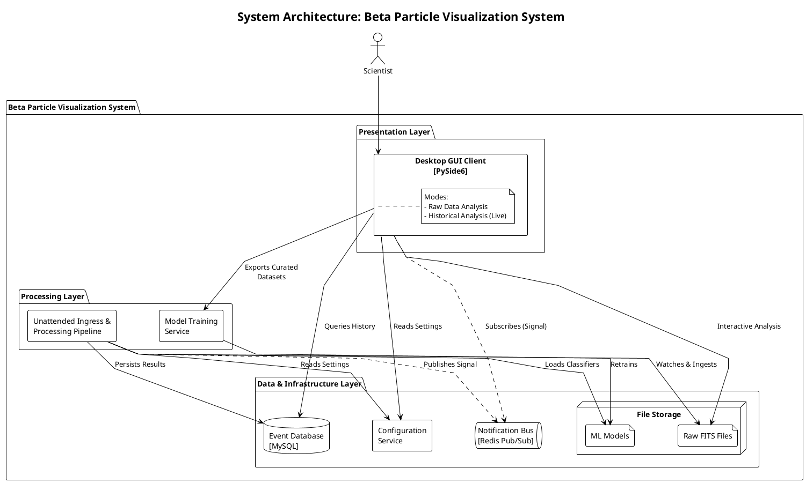

### Justification

This architecture was chosen to cleanly separate the two primary use
cases of the system: unattended monitoring and interactive discovery.

**Modularity:** Each component is developed as a distinct service with
clear boundaries, allowing for independent development and maintenance.
For example, the Unattended Pipeline team can optimize the
classification algorithm or even swap out the entire ML model without
impacting the GUI's development, as long as the data contract (the
database schema) is upheld. Conversely, the Desktop GUI can be
refactored to use a new charting library without any changes to the
backend data processing. This loose coupling significantly simplifies
testing and debugging.

This modular approach directly addresses the stakeholder's request for a
codebase that is 'extensible and flexible... so that it can kind of do
anything' and allows for future features to be added without
destabilizing the core physics processing \[5\].

**Responsiveness:** The architecture ensures the user interface remains
fluid and interactive, even during resource-intensive operations, by
decoupling heavy processing from the main UI thread. For the Unattended
Pipeline, when it ingests and processes large FITS files, this occurs
entirely as a background service; the Historical Event Analysis
Application retrieves and displays the *latest processed data* from the
Event Persistence Service without blocking, effectively presenting the
newest historical results as a "real-time display." Similarly, within
the Interactive Raw Data Analysis Application, computationally intensive
tasks such as clustering energy events or applying complex filters, are
offloaded to dedicated background threads. This design prevents the GUI
from freezing, allowing users to continue interacting with the
application while analysis is performed asynchronously.

This separation is critical because the backend must be 'constantly
taking... lots of data to collect large background samples' \[5\], while
the user interface must remain fluid for 'intuitive judgments',
decoupling the high-uptime data ingestion from the human-driven
analysis."

**Scalability:** While the initial implementation uses a local pipeline
and database, the current architecture allows for future scaling. The
backend services could be moved to a remote server, and the database
could be a more robust client-server system, supporting a variety of
clients including potential web or mobile applications without requiring
a full redesign.

**Responsiveness & Traffic Management:** The architecture separates
"Signaling" from "Data Transfer." By sending only lightweight event IDs
over the notification bus (Redis) and requiring the client to fetch
heavy payload data (BLOBs) from the database only on demand, the system
prevents network congestion. This ensures the "Live Mode" remains fluid
even during high-rate particle events that might otherwise flood a
direct data stream.

## Functional Area Detail

This section describes the major components or modules of the system.

### 1. Interactive Raw Data Analysis Application

This functional area is the primary tool for scientific discovery and
insight generation. It is the direct embodiment of the project's
essence: a visual analysis tool that empowers scientists to directly
explore, and experiment with raw CCD data. By providing an interactive
environment to inspect, filter, and process data, it enables the
discovery of subtle features and the validation of algorithms, which are
crucial steps for designing and improving machine learning models.

#### Key Features

- **FITS Data Loading & HDU Mosaic Navigation:** The application parses
  multi-HDU FITS files, treating each extension as a potential distinct
  exposure.

  - **Image Validation**: The loader automatically filters the file
    structure to identify extensions containing valid 2D image data
    (e.g., Primary HDUs or extensions where XTENSION='IMAGE' and
    NAXIS=2). Non-image extensions are excluded from the visual workflow
    \[7\].

  - **Mosaic View:** Valid image HDUs are populated into a Mosaic View
    navigation strip at the top of the workspace. This allows users to
    rapidly assess the quality of all quadrants and instantly switch the
    active view by selecting the corresponding thumbnail, without
    reloading the file.

- **Interactive Visualization:** Provides the primary canvas for data
  exploration. This rich, interactive view represents the
  high-dynamic-range data using configurable colormaps for clear visual
  distinction between energy levels. It supports fundamental
  interactions such as panning, zooming, and inspecting the precise
  energy value of any pixel. Visualization is also the foundation for
  other key features, enabling users to:

  - **Select Regions:** Draw a bounding box on the image to define a
    region of interest for localized Asynchronous Cluster Extraction.

  - **Select Events:** Click on cluster bounding boxes (from either the
    Historical Analysis Overlay or an interactive clustering run) to
    perform Event Inspection and Curation.

  - **Magnify Details:** Use a 'Magnifier' tool to view a zoomed-in,
    non-downscaled portion of the data for precise analysis.

- **Dynamic Filtering:** UI controls, such as range sliders, to
  dynamically filter the visualized data in a non-destructive way. This
  includes both truncation of values outside a specified range and
  planned support for additive interactive filtering, like gamma
  correction, to enhance visual contrast and detail.

- **Interactive Filter Stack:** The application utilizes a layer-based
  stack rather than single, isolated filters. Users can build a
  sequential stack of processing steps to observer their cumulative
  effects on the raw data.

  - **Foundation**: The pipeline begins with the pedestal subtraction
    (default value comes from the Configuration Manager) to remove
    detector-specific noise patterns before further analysis.

  - **Custom Stack**: Users and stack additional filters on top of the
    base layer. The supported filters include, but are not limited to:
    Gaussian, Median, Laplacian, Mean, Histogram Equalization,
    High-pass, and Low-pass.

  - **Interactive Control**: Each step in the pipeline is independently
    configurable and toggleable. Users can adjust parameters (such as
    sigma value for Gaussian blurring) for a specific layer and
    immediately visualize how that change propagates through the result.

- Parameters for each filter are configurable by the user in the UI,
  with default values being managed by the Configuration Management
  service.

- **Asynchronous Cluster Extraction:** The capability to run various
  segmentation algorithms on user-selected regions of the raw data, such
  as an area selected via a bounding box or the region currently under
  the Magnifier tool. This is a key distinction from the unattended
  pipeline, which processes the entire image. Supported methods include
  'Classical Connected Components' and 'HDBSCAN' for noisy data
  exploration, with all processing run asynchronously to keep the UI
  responsive.

- **Event Inspection and Curation:** This feature allows for detailed
  analysis of event clusters found via the interactive Asynchronous
  Cluster Extraction, completely decoupled from the automated pipeline's
  results.

  - **Inspection:** When a user selects an unclassified cluster, the
    application will calculate and display its immediate properties,
    such as highest energy pixel location and value, min/max intensity,
    median, standard deviation, and an energy distribution histogram.

  - **Curation:** A user can then choose to "curate" an inspected
    cluster by manually sending it to the CNN for classification,
    providing a direct, human-in-the-loop method for verifying
    interesting phenomena.

- **Export for Training:** A mechanism to send a curated list of
  selected events (along with a user-provided label) to the
  EventCurationService via an API call (e.g., REST API), creating a
  feedback loop for improving machine learning models.

- **Historical Analysis Overlay:** This feature allows a user to query
  the Event Persistence Service for analysis results that were
  previously generated by the Unattended Ingress & Processing Pipeline.
  If the currently viewed FITS file has been processed, the system
  fetches the historical event clusters and displays them as a
  semi-transparent overlay (e.g., using colored bounding boxes). This is
  crucial for visually comparing the precise, automated analysis with
  the raw data, allowing a scientist to quickly verify results or
  identify subtle events that the pipeline may have missed.

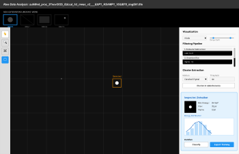

Figure 1- Raw Analysis Wireframe [(full view in the appendices
section](#interactive-raw-data-analysis-application-1))

Figma: [Raw Analysis Wireframe](https://www.figma.com/design/CynlZxFAClT7j4A7aBatry/MLCCD_Viz?node-id=5-449&t=uyydMJh3HhXeeMac-4)

#### 

#### High-Level Flow Diagram

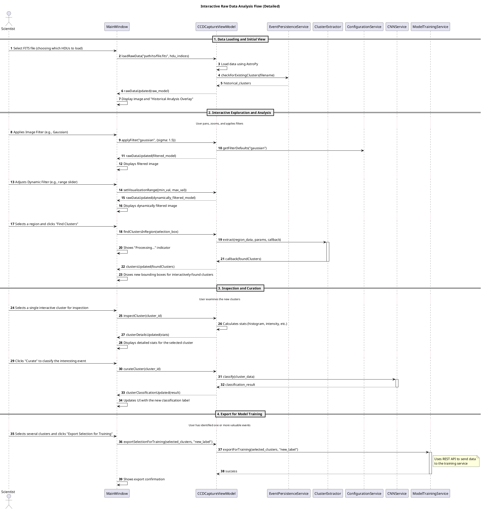

#### Dependencies and Contracts

| **Dependency** | **Contract / Interface** | **Purpose** |
| --- | --- | --- |
| Configuration Management | ConfigurationService interface | Provides access to system-wide settings, such as default parameters for image processing filters. |
| Event Persistence Service | HistoricalDataService interface | Provides a method to query for previously processed clusters associated with a specific FITS file, enabling the "Historical Analysis Overlay" feature. |
| Model & Training Data Management | CNNService interface | Provides an interface for on demand classification of a single, user-selected cluster. |
| Model & Training Data Management | EventCurationService (or ModelTrainingService) REST API | Exposes a REST API to receive curated events that the user exports for future model training. |
| Image Processing Strategy | VizFilter interface | Defines a standard contract (e.g., apply(image\_data)) for visual algorithms. This allows the Interactive Filter Stack to chain multiple effects (Pedestal, Gaussian, etc.) dynamically for visualization without permanently altering the underlying raw data, distinguishing it from the Unattended Pipeline's destructive processing. |

#### 

#### Proposed Technologies

 
| **Steps and Tasks** | **Proposed Technologies** |
| --- | --- |
| GUI Framework and Application Structure | **Python 3** and **PySide6** (chosen for its flexible LGPL license). The architecture will follow the **Model-View-ViewModel (MVVM)** pattern. |
| Asynchronous Processing | Generic **worker threads** with PyQt's **signal and slot mechanism** for safe communication with the main UI thread, ensuring a responsive application. |
| FITS File Ingestion | **AstroPy** library for robustly reading and parsing FITS files. |
| Core Numerical and Scientific Analysis | **NumPy** for all fundamental numerical data structures. **HDBSCAN** for density-based spatial clustering in 'Discovery Mode'. Custom implementation of **Connected Components** (Classical) for parity with the pipeline's physics requirements. |
| Secondary/Performance- Critical Visual Tasks | **OpenCV** for high-performance **visualization rendering only**. It will be used to generate false-color bitmaps (using Colormaps like JET/Viridis) from 16-bit float data for display in PyQt. _Note: OpenCV will not be used for analysis to avoid bit-depth data loss._ |

### 

### 2. Historical Event Analysis Application

This functional area provides a powerful suite of
tools for long-term monitoring and statistical analysis of processed
data. It allows scientists to query the entire history of classified
events using a custom interface with fine-grained filtering and sorting
controls. The results are presented in a highly visual event browser,
where each detected particle is shown with a thumbnail for immediate
context. From there, a user can drill down into a detailed view for any
single event or generate comprehensive statistical summaries and
time-series plots to analyze trends in the entire queried dataset. All
generated data, from event lists to summary tables and plots, can be
exported for reporting and publication.

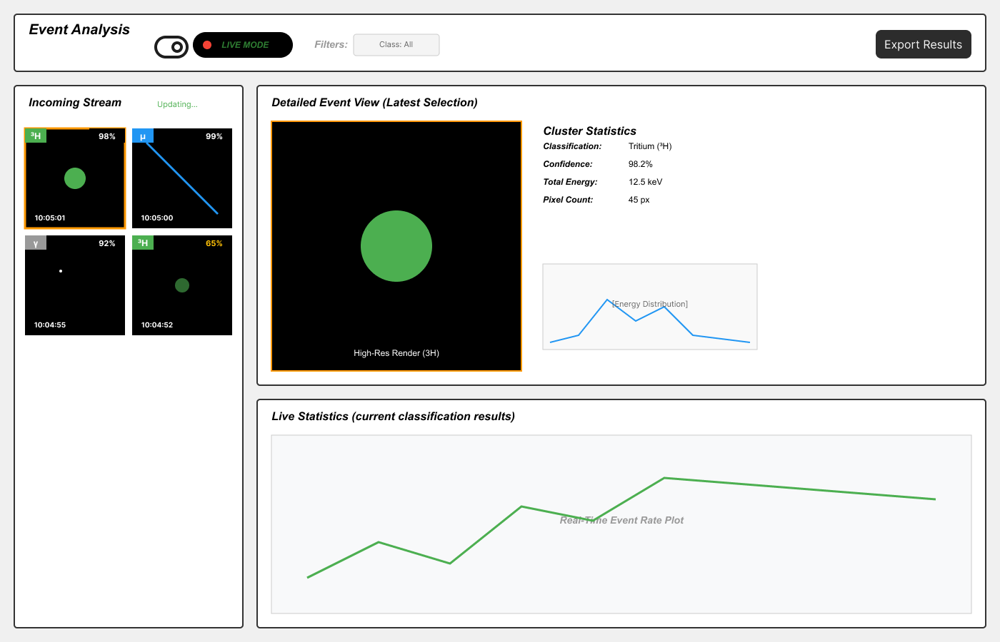

Real-Time View Wireframe

Figma: [Real-Time View Wireframe](https://www.figma.com/design/CynlZxFAClT7j4A7aBatry/MLCCD_Viz?node-id=2-169&t=uyydMJh3HhXeeMac-4)

#### Key Features

- **Live Monitoring Mode:** A specific operational state controlled by a
  "Live Mode" toggle. When active, the interface locks the query filters
  to the live data stream, disables manual sorting to strictly
  prioritize the newest incoming events, and displays a pulsing status
  indicator to confirm that the Unattended Pipeline is actively pushing
  new results to the view.

- **Query Interface:** A custom UI control providing intuitive filtering
  and sorting capabilities for the event database. Users can filter
  events by date/time range, classification type, and confidence score.
  Results can be sorted (ascending or descending) using the same
  criteria.

- **Event Browser and Visual Metadata:** This serves as the primary
  display area for query results. It presents a high-density grid of
  detected clusters to maximize the number of events visible at once.
  Each thumbnail includes Metadata Badges overlaid on the
  corners—displaying the Classification Type (e.g., ³H, µ) and
  Confidence Score—allowing scientists to visually scan the dataset for
  anomalies without needing to select individual events for details.

- **Detailed Event View:** When a specific event is selected from the
  Event Browser, this view displays its full detailed properties. Since
  the database stores raw energy values (floats) rather than images,
  this view will utilize a shared **Visualization Utility** (powered by
  OpenCV) to dynamically render a larger thumbnail and associated data
  with appropriate colormaps (e.g., viridis, jet).

- **Statistical Summary & Plotting:** Provides a comprehensive overview
  of the queried dataset. The **Statistical Summary** will present key
  metrics in a tabular format, including counts of detected particles
  (per classification type), average cluster density (pixels per
  cluster), and standard statistical indicators such as mean, mode, and
  distribution for relevant event properties. The **Plotting** component
  will generate visualizations, primarily time-series plots that group
  events (e.g., daily, or hourly counts), allowing for trend analysis
  over specified periods.

- **Data Export:** Allows the user to export the current analysis
  results—including the filtered event list from the browser, summary
  statistical tables, and generated plots—by invoking the shared Results
  Export & Reporting service.

#### High-Level Flow Diagram

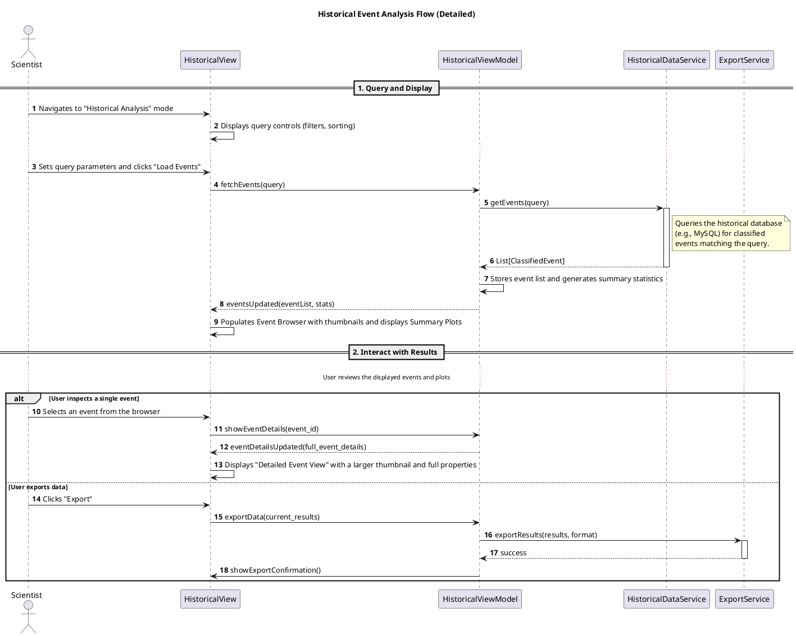

#### Proposed Technologies

 
| **Steps and Tasks** | **Proposed Technologies** |
| --- | --- |
| GUI Framework | This view will be part of the main application built with **Python 3** and **PySide6**. |
| Tabular Data Handling | **Pandas** library and its DataFrame for high-performance, in-memory filtering, sorting, and aggregation of queried event data. |
| Statistical Plotting | **PyQtGraph** for fast and interactive scientific plots embedded within the PyQt application. **Matplotlib** will be used to generate high-quality, publication-ready static plot files for export. |
| Core Numerical Operations | **NumPy** for any underlying numerical calculations. |

#### 

#### Dependencies and Contracts

| **Dependency** | **Contract / Interface** | **Purpose** |
| --- | --- | --- |
| Event Persistence Service | HistoricalDataService interface | Provides methods for querying historical data and exposes a subscription mechanism (e.g., Observer pattern). When the service receives a "New Event" signal from the pipeline, it automatically fetches the full event object (including raw data) from the database and updates the Live View grid client-side. |
| Results Export & Reporting | ExportService interface | Provides a unified interface for exporting several types of data (event lists, summaries, plots) to files. |
| Configuration Management | ConfigurationService interface | Provides access to system-wide settings, such as default display options or query parameters. |

### 

### 3. Results Export & Reporting

This functional area is a shared, backend service that centralizes all
logic for translating in-memory application data into persistent files
on disk. Its primary purpose is to provide a single, consistent
interface for other components to export distinct types of data, such as
event lists, statistical summaries, and plots. The service manages the
specific details of file format conversion (e.g., to CSV or PNG) and
provides a uniform, user-friendly experience for file saving operations
via native dialogs. This decouples the core application logic from the
implementation of file I/O, making the overall system more modular and
maintainable.

#### Key Features

- **Tabular Data Export:** Provides comprehensive export of in-memory
  tabular data into common formats like CSV. This service is responsible
  for translating application data structures into a file format
  suitable for external analysis. Its capabilities include:

- **Event List Export:** Exports a list of ClassifiedEvent objects, such
  as the filtered and sorted results from the Historical View's event
  browser, into a CSV file. Each row represents a single event, with
  columns for all relevant properties (e.g., ID, classification,
  confidence, timestamp, energy statistics).

- **Statistical Summary Export:** Exports aggregated data and summary
  statistics, such as the tables generated in the Historical View, into
  a CSV or formatted text file.

- **Plot/Image Export:** Saves generated plots and charts (e.g., from
  PyQtGraph or Matplotlib) as image files in formats like PNG or SVG for
  use in presentations and publications.

- **User-Friendly File Dialogs:** Presents a native file dialog for
  every export operation. To ensure a consistent user experience, the
  dialog is initialized with a default path retrieved from the
  Configuration Management service, while still allowing the user to
  browse to any location to confirm the final save path and filename.

#### High-Level Flow Diagram

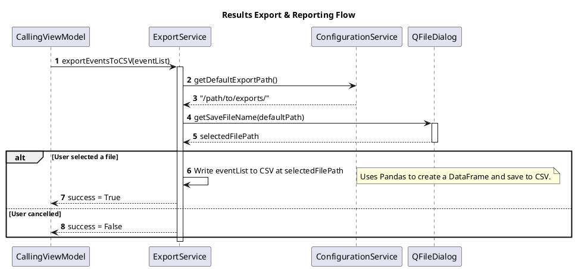

#### 

#### 

#### Dependencies and Contracts

| **Type** | **Component /** **Service** | **Contract / Interface** | **Purpose** |
| --- | --- | --- | --- |
| **Provided** | Results Export & Reporting | ExportService interface | Implemented by this component, it offers a unified interface to other parts of the application for exporting data to files. |
| **Dependency** | Configuration Management | ConfigurationService interface | Used to retrieve systemwide settings, specifically the default export directory path to initialize the native file dialog. |

#### Proposed Technologies

 
| **Task /** **Process Step** | **Proposed Technologies & Rationale** |
| --- | --- |
| **Service** **Invocation &** **Control** | The service will expose a unified interface (e.g., an export method) to be called by ViewModels. It will use standard Python data structures to receive in-memory data (e.g., lists of objects, Pandas DataFrames, Matplotlib figures). |
| **File Path &** **Name** **Resolution** | It will use **PySide6**'s QFileDialog.getSaveFileName to present a native file dialog. This ensures a consistent, platform-appropriate user experience for choosing the save location and prevents overwriting files without confirmation. Default paths will be retrieved from the ConfigurationService . |
| **Tabular Data** **Serialization** | For exporting event lists or statistical summaries to CSV, the service will use the **Pandas** library. Data will be converted to a DataFrame which can then be efficiently written to a CSV file using its to\_csv() method. This is robust and handles various data types well. |
| **Graphical** **Data** **Serialization** | For exporting plots and charts, the service will interface directly with plot objects. It will use the built-in saving mechanisms of **Matplotlib** (savefig()) or **PyQtGraph**'s exporters to generate high-quality PNG or SVG image files. |

### 

### 4. Unattended Ingress & Processing Pipeline

This functional area is the automated, "high precision" workflow that
ingests raw FITS files, performs image segmentation to identify particle
event clusters, and runs them through a pretrained machine learning
model for classification. This is the core data production engine of the
system. It would facilitate the retrieval and processing of the data
directly output from the Charge-Coupled Device. The pipeline would
automatically retrieve any new data output from the CCD, perform
clustering of the exposure into isolated events, save the clusters and
raw data, and input the cluster results into machine learning models for
automated classification of events. This area relies heavily on accurate
clustering and processing of the data, as well as formatting it for the
machine learning models present and indexing it in an easily retrievable
way for historical views. The functionality here allows for scientists
at the lab to have the bulk of their processing and segmentation
automated and presented in an easily digestible format with all of the
data that they would want to know (such as the energy per pixel, the
standard deviation of the cluster height and width, and the total
energy).

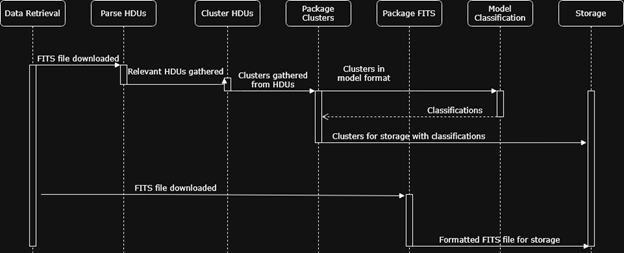

Figure 1. UML diagram of the Unattended Ingress and Processing Pipeline flow

- **Data Retrieval -** Queries the storage for new data from the CCD,
  either uploaded locally or remotely using a separate thread to allow
  for simultaneous retrieval and processing.

- **Parse HDUs -** HDUs, or Header Data Units, are a part of the FITS
  file format that contain the exposure data from the CCD, which will be
  the relevant part of the file for identifying clusters.

  - **FITS Metadata -** Relevant FITS metadata will be gathered here as
    well, such as the time of exposure and date gathered to be packaged
    with the data. This data is stored in the headers of the FITS files
    that can be retrieved and stored along with it.

- **Cluster HDUs -** By using the Lab’s tested 4 sigma approach for the
  CCD deployment (which is taking values only above 4 standard
  deviations of the exposure), the HDU’s that contain pixel data of
  energy levels can be clustered based on this threshold and collected.

  - **Cluster Data -** There are many relevant factors in the layout of
    the clusters to keep track of, such as total energy and standard
    deviation of pixels, that will need to be captured and packaged with
    the cluster for both classification with all of the lab’s machine
    learning models and storage.

  - **Blob Storage -** To save the clusters, which are NumPy arrays of
    floating point numbers related to the charge values of each pixel,
    into a relational database, the cluster arrays will be turned into
    its byte representation using a method like numpy.save().

- **Package Clusters -** By using this clustered image, which will be in
  the format of an array of floating point values, and its relevant
  data, it will be formatted and packaged here in a format for
  classification by the Lab’s machine learning models.

  - **After Classification -** After the models have returned their
    classification of the cluster identifying the likeliness of a
    tritium decay event, this classification will be stored with the
    cluster information and packaged for easily retrievable storage. If
    this clustered event is rated at or above a 0.75 (meaning 75%
    confidence) of a tritium decay event, it is packaged as well for
    storage in a tritium decay table.

- **Package FITS -** The FITS file that is retrieved directly from the
  CCD will be packaged here for storage with data on its exposure time
  and date gathered for use and easy association with clusters gathered.

  - **Blob Storage -** FITS files are already a binary file, which makes
    storing them as a blob in a relational database relatively simple,
    although storage size concerns do persist with storing large amounts
    of FITS files. The headers of the files may be stored instead of the
    raw binary data itself to alleviate any concerns with data growth.

- **Model Classification -** The lab has made use of a few machine
  learning models that they have designed, such as a Convolutional
  Neural Network, an Energyflow model, and a Boosted Decision Tree; all
  of which desire a different format of input that will be satisfied by
  the previous clustering functionality. Here these models will retrieve
  their respective input of cluster and return their classification of
  particle/decay type, which will all be packaged with the clusters for
  further examination and review.

**Storage -** The application will have access to a database for storage
of clusters and FITS file in an appropriate format with relevant
metadata to identify them by in an easily retrievable way. Both the
clusters with their machine learning model classifications and the raw
FITS files will be stored here for further use by the application.  
**Real-Time Completion Signal:** Upon successfully persisting a
classification result, the pipeline publishes a minimal "completion
signal" to the Redis events/new_classification channel. This payload
contains only the Event ID and source filename. This lightweight
approach decouples the analysis logic from the visualization logic; the
pipeline simply notifies observers that new data is available in the
database, without needing to generate or transmit visual assets itself.

### 5. Event Persistence Service

This is the backend component responsible for writing the classified
event data (generated by the Unattended Pipeline) into the structured,
long-term database (MySQL). It manages the database schema and ensures
data integrity, providing the crucial link between real-time processing
and historical analysis. This functional area provides the database and
storage structure that allows for the cluster information and raw FITS
data from the CCD to be stored and retrieved for viewing. The structure
and performance of this database is crucial for responsiveness in the
application and the sorting and congregation of data for viewing. The
structure of the database is designed with the key functional areas
previously laid out in mind, and is designed to make sorting and
grouping of these clusters and files easy.

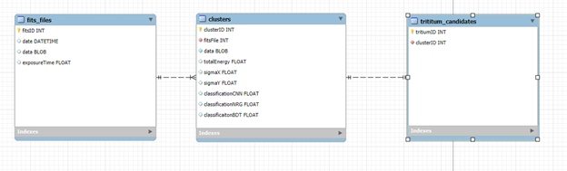

Figure 2. An Entity Relationship Diagram of the Event Persistence Database

- **fits_files -** This table contains the FITS files gathered from the
  CCD in their raw binary format, along with the date that corresponds
  with its time gathered, and its exposure time.

  - **date -** The date that the FITS file was retrieved

  - **data -** The raw binary data of the FITS file in bytes that can
    recreate it completely, although this is depending on the size of
    the FITS files that will be received, as well as the amount of data
    we can store in the MySQL database. If the amount of data being
    worked with is too large to save and retrieve consistently, the data
    field will only consist of identifying headers to identify the
    exposure.

  - **exposureTime -** The time that the CCD was open to exposure of
    events, stored in the EXPTIME header in the FITS file.

- **clusters -** This table contains the array of energy that makes up
  the cluster from the CCD exposure, as well as the relevant metadata
  and relation to the FITS file that it came from.

  - **fitsFile -** The FITS file / exposure that the cluster was found
    in

  - **data -** The array of floating point energy values that make up
    the cluster in binary form

  - **totalEnergy -** The total energy value of the cluster

  - **sigmaX -** The standard deviation from the highest energy value in
    the cluster on the x-axis

  - **sigmaY -** The standard deviation from the highest energy value in
    the cluster on the y-axis

  - **classificationCNN -** The confidence in classification of tritium
    decay that the Lab’s Convolutional Neural Network gave the cluster

  - **classificationNRG -** The confidence in classification of tritium
    decay that the Lab’s Energyflow model gave the cluster

  - **classificationBDT -** The confidence in classification of tritium
    decay that the Lab’s Boosted Decision Tree model gave the cluster

- **tritium_candidates -** When the clusters are classified and
  packaged, if a model rated them as above a 75% chance/confidence of
  being a tritium decay event, it will be stored here for quick access.
  This could be implemented as a specific view as well, depending on the
  efficiency and size of generated data.

<!-- -->

- **clusterID -** The cluster that the machine learning models rated as
  above a 75% chance of being a tritium decay event.

### 6. Configuration Management

The configuration management service is designed to be the centralized
source of truth for all operational parameters across the system. It is
primary responsibility is to single-source settings such as file paths,
algorithm thresholds, machine learning model selections, colormaps,
export defaults, and network endpoints so that both the interactive
client and the unattended back-end services behave consistently. To
achieve low-latency distribution of frequently accessed values, the
design uses **Redis** as a fast-access cache and a notification bus,
while durable persistence is handled by a relational database. The dual
layer approach allows the system to combine the responsiveness required
by the real-time pipeline and GUI with the permeance of auditability
required for reproductivity and regulatory compliance.

### High Level Principles

- Provide a **single source of truth** for runtime settings, so the GUI
  and pipeline use the same parameters.

  - All operational parameters are centrally stored and accessible by
    every component (GUI clients, unattended pipeline, model services,
    persistence services).

- **Low Latency Distribution:**

  - Common runtime parameters need to propagate quickly.

  - Integrated using Redis for fast key reads and pub/sub notifications.

- **Durable Persistence:**

  - Redis is used as the fast-access layer, not the canonical long-term
    store.

  - Persisted configurations such as history, versions, audit logs will
    live in durable storage such as MYSQL or a file-backed repository
    like YAML/JSON

- **Validation and Schema:**

  - All keys are validated against a schema (types, allowed ranges,
    enumerations) before being accepted.

  - Justification: to prevent accidental misconfiguration that could
    break detectors' data ingestion or selected model pipelines.

- **Name spacing:**

  - Logical namespaces prevent collisions between components:

    - global:

    - pipeline:

    - gui:

    - models:

    - export:

- **Versioning:**

  - Maintain versions of configuration to support safe rollbacks and
    reproduce prior run conditions for debugging and analysis

- **Synchronization:**

  - Use Redis pub/sub for change notifications; optionally support a
    REST API for richer interactions (get/put/list/preview/commit)

- **Offline Resilience:**

  - Clients must be able to operate with a local cache copy of the
    configuration if connectivity to the central service is temporarily
    lost

- **Human-Centered UI:**

  - Provide a configuration editor in the GUI for lab operators with
    validation feedback, and an “apply to backend” workflow feature.

### Primary Components

1.  Configuration Service (Central Server)

2.  Cache & Notification Layer (Redis)

3.  Durable Store (MySQL or YAML/JSON)

4.  Configuration Software Development Kit (SDK) -- Client Libraries

5.  Management UI

6.  History Store

### Configuration Service

The configuration service component exposes a small REST API for CRUD
operations on configuration keys (GET, PUT, DELETE, LIST).

Example REST API Operation Syntax:

- GET/config/{namespace}/{key}

- PUT/config/{namespace}/{key}

- DELETE/config/{namespace}/{key}

- LIST/config/{namespace}/{key}

The service is responsible for validating incoming changes against a
JSON Schema catalog before accepting them. Validation ensures type
safety, enforces numeric ranges and enumerations, and prevents
accidental changes to sensitive keys (e.g. pipeline input paths or
database URLs). On a successful commit, the service creates a new
version record, writes the new payload to the durable store, appends an
immutable audit entry, updates the Redis cache with the new key-values,
and publishes a lightweight pub/sub notification that contains only
minimal metadata: changed key list, new version ID, timestamp, and an
optional tag (staged, apply immediately, canary). This service supports
atomic batch commits so coordinated multi-key changes (for example
swapping a model ID and adjusting its preprocessing parameters) cannot
leave the system in a partially updated state. The configuration service
will also offer endpoints to list available schemas, preview a commit
(validation-only), and rollback to a prior version. Operationally, the
configuration service should be stateless with a small persistent queue
for sequencing comments and be deployed behind load balancers, where
horizontal scaling is possible due to externalized persistence and
notifications.

### Cache & Notification Layer

Redis is the fast-path for runtime reads and the notification bus for
change of propagation. Every accepted configuration version is pushed
into Redis, so clients can fetch values with sub-millisecond latency.
Redis keys will use the same hierarchical *namespace:key* naming
convention as the configuration service to simply client logic. For
change notifications, the service publishes on a small set of channels
with compact JSON indicating which keys change and a version pointer.
Clients can then selectively fetch the updated keys rather than relying
on a full payload embedded in the message. This keeps messages small and
avoids sending large amounts of content through publish/subscribe
(pub/sub). Redis will be configured with persistence (RDB/AOF) to reduce
the risk of transient data loss and should be deployed in a
high-availability topology (replication, sentinel or cluster) tolerate
failover. Clients must treat Redis as a cache: expiration policies and
real-through fallback to the durable store must be implemented in the
client's library, so the overall system tolerates Redis' restarts or
partitions.

### Durable Storage

The durable store is the canonical long-term repository for
configuration data, version history, and audit trail. A small,
normalized schema should separate current items, version snapshots, and
audit metadata.

Typical tables include:

1.  config_items – namespace, key, current version ID

2.  config_versions – version ID, payload JSON, created by, creation
    timestamp, message

3.  config_audit – version ID, diff, author, timestamp

The durable store supports queries for historical state, diffs, between
versions, rollbacks, and forensics. It will also serve as an
authoritative source for clients that must reconstruct the last-known
good configuration when both Redis and the configuration service are
unreachable.

If a file-backed approach using YAML or JSON is implemented over the
relational DB approach, then the service must maintain atomic commit
semantics and implement clear backup and retention policies to avoid
accidental loss.

### Configuration Client Software Development Kit – Client Libraries

The client libraries are the recommended integration surface for both
the GUI and the unattended pipeline. Rather than having each component
implement Redis connection logic, HTTP requests, schema parsing, and
caching, these capabilities are encapsulated in a small SDK. The Python
SDK exposes functions to support most of the CRUD operations.

Internally, the SDK implements the recommended cache strategy:

1.  Check local in-process cache

2.  Read Redis

3.  Read durable store as a fallback option

It will automatically subscribe to the Redis notification channel and
trigger to register callbacks with the changed key list. The SDK will
also encapsulate reconnection/backoff behavior, JSON schema validation
helpers for client-side preview and faster error feedback, and a mock
mode to facilitate unit testing.

### Management UI – GUI Settings

The management UI will be the human-facing frontend for managing
configuration values. The primary integration will be a settings screen
inside the desktop GUI app that groups keys into meaningful sections
(global, pipeline, models, GUI). The UI will use the same JSON Schema
that the server uses field-level validation, so users get immediate
feedback if an invalid input is entered.

Key Management UI Features:

- Staged change workflow – edit multiple keys, preview the combined
  effect, commit with message and author

- Version history browser – includes diffs and rollbacks controls

- Model registry UI – offers the ability to view available model
  artifacts and select the active model

The UI must surface warnings when changes are disruptive, such as
changing the pipeline's FITS input path and, when applicable, requires
an authoritative action to be applied on such a change.

### History Store & Auditing

The history store is a provenance system that makes configuration
reproducible and supports forensic analysis. Every commit produces a
version of a snapshot and a human-readable diffs that are appended to
the history store. The history UI supports querying date range, by
author, or by key, and it provides tools to export a specific historical
configuration such as JSON or YAML for re-running past analyses. The
audit trail is intentionally immutable and indexed for rapid retrieval;
it must include who changed what, why, and the exact payload before and
after the change. Retention policies should be defined to balance
forensic needs with storage budgets; older history can be archived to
cold storage while keeping recent history hot for fast access.

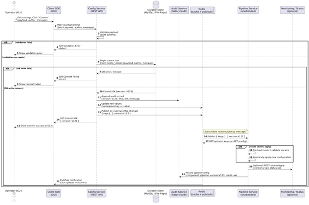

**Figure 7:** Configuration Management Service Workflow

Since key-value stores typically do not have a native concept of
"folders," we will simulate this organization using Colon-Separated
Prefixes (scope:functional_area:parameter).

This creates logical namespaces that group related settings together:

- global: Infrastructure settings shared by all services (Pipeline, GUI,
  Persistence).

- gui: Settings specific to the user-facing Desktop Client application.

- pipeline: Settings specific to the backend Unattended Ingress &
  Processing Pipeline.

| **Key (Namespace)** | **Type** | **Default Value** | **Description** |
| --- | --- | --- | --- |
| **Global / Infrastructure** |     |     |     |
| global:db:connection\_string | String | mysql://... | Connection string for the MySQL Event Persistence Service. |
| global:redis:host | String | localhost | Hostname for the Redis server used for notifications. |
| global:redis:port | Integer | 6379 | Port number for the Redis service. |
| global:redis:channel\_events | String | events/new\_class | The Pub/Sub channel name for "New Event" signals. |
| Interactive Raw Data Analysis |     |     |     |
| gui:raw\_analysis:default\_colormap | String | "viridis" | Default colormap used when loading raw FITS data. |
| gui:raw\_analysis:vis\_range\_min | Float | 0   | Initial lower bound for the visualization range slider (keV). |
| gui:raw\_analysis:vis\_range\_max | Float | 20  | Initial upper bound for the visualization range slider (keV). |
| gui:raw\_analysis:filter\_gaussian\_sigma | Float | 1.5 | Default sigma value for the interactive Gaussian blur layer. |
| gui:raw\_analysis:clustering\_threshold | Float | 4   | Default sigma multiplier for interactive cluster extraction. |
| **Historical Event Analysis** |     |     |     |
| gui:historical:default\_query\_hours | Integer | 24  | Default lookback period (in hours) when opening the view. |
| gui:historical:live\_update\_rate\_ms | Integer | 1000 | Minimum throttle rate (in ms) for refreshing the grid in Live Mode. |
| gui:inspector:histogram\_bins | Integer | 50  | Number of bins for the Energy Distribution Histogram (shared). |
| **Export & Reporting** |     |     |     |
| gui:export:default\_path | String | ~/Data | Default directory path used to initialize the file save dialog. |
| gui:export:image\_format | String | "png" | Preferred file format for exporting plots and thumbnails. |

### 7. Model & Training Data Management

This functional area provides the tools to support the
"human-in-the-loop" machine learning workflow. It includes features to
support the GUI for users to select, label, and export interesting
events into new training datasets, and to load different trained models
to evaluate their performance.

This functional area differs from the rest in the sense that the use of
it has to be consciously activated, as it concerns itself with the user
interaction with the clusters and interesting data that they have
located in the Interactive Raw Data Analysis Application, allowing for
them to use their selection and gathered information to pass to the
machine learning models for classification. This toolset can be used by
the user to input what they select and export from their view of the CCD
exposures directly into a machine learning model of their choice,
automatically formatting it into the model’s desired format, and
returning a classification. This functionality goes hand-in-hand with
the Raw Data Analysis that the application offers, as it allows for the
complementary skills of a human user and a machine learning model to
classify events in the exposure.

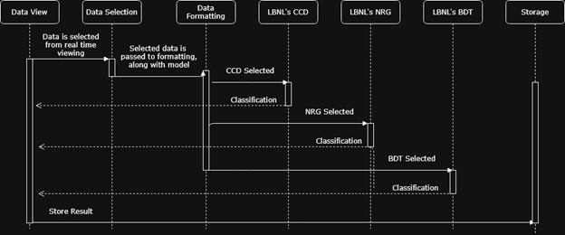

Figure 3. UML Diagram of the Model and Training Data Management

- **Data View -** This represents the Interactive Raw Data Analysis
  Application functional area where users can select clusters and points
  of interest from raw FITS data that they are examining with their
  mouse.

- **Data Selection -** Once the user selects the point of interest that
  they want to examine further, they will be able to select if they want
  to have their selection classified by a machine learning model, and
  specifically which models they want to send their input to.

- **Data Formatting** - Based on the user’s selection in the previous
  portion, the selected cluster array will be sent to this service
  through a REST API call. The service will then take this array and
  format for input on the machine learning model that was selected,
  allowing the user to only concern themselves with selection instead of
  formatting.

- **LBNL’s CNN -** This refers to the lab’s Convolutional Neural Network
  model, which will take the specific selection that is formatted for
  its input and return its classification to the user through a REST API
  response.

- **LBNL’s NRG -** This refers to the lab’s Energyflow model, which will
  take the specific selection that is formatted for its input and return
  its classification to the user through a REST API response.

- **LBNL’s BDT -** This refers to the lab’s Boosted Decision Tree model,
  which will take the specific selection that is formatted for its input
  and return its classification to the user through a REST API response.

- **Storage -** After the user has received the classification from
  their selected machine learning models, they will be able to choose to
  store that cluster as a tritium candidate, saving the relevant data
  and metadata to input into the relational database based on their
  input.

  - **Store Input -** Based on the user’s selection of clusters or CCD
    exposure and their model of choice, the data will be gathered and
    stored into the database with the relevant data.

## System Dependencies

### System Software

| **Technology** | **Purpose in Project** |
| --- | --- |
| **Python 3** | The core programming language for the entire application. |
| **PySide6** | The GUI framework for building the desktop application. |
| **NumPy** | Fundamental library for all numerical data structures and calculations. |
| **AstroPy** | Robustly reading and parsing the FITS file format. |
| **Pandas** | High-performance, in-memory tabular data handling (e.g., for filtering and sorting in the historical view). |
| **PyQtGraph** | Fast and interactive scientific plots embedded within the GUI. |
| **Matplotlib** | Generating high-quality, publication-ready static plot files for export. |
| **scikit-image/scikitlearn** | Implementation of classical clustering and image processing algorithms. |
| **OpenCV** | High-performance visualization rendering (e.g., generating false-color bitmaps from HDR data). |
| **Keras** | Loading and running the pre-trained ML models for classification. |
| **MySQL** | The client-server relational database for storing all classified event data via the Event Persistence Service. |
| **PyMySQL** | A pure-Python MySQL client library used to connect to the Event Persistence Service. Selected for its MIT License, avoiding the GPL restrictions of the official MySQL connector. |
| **Redis** | A fast key-value store and publisher/subscriber for configuration and signals, which include required versions, HA topology recommendations) |
| **Docker** | Containerization for backend services (pipeline and configuration service) to unsure reproducibility |

Pyside6 was explicitly chosen over PyQt6 due to its licensing
flexibility. PySide6 is licensed under the LGPL (Lesser General Public
License), which allows for dynamic linking in proprietary or
closed-source applications without requiring the entire application’s
source code to be released. This ensures that the LBNL team retains the
option to distribute the software or its derivatives in the future
without the strict copyleft constraints imposed by the GPL license found
in standard PyQt.

### System Hardware

- **Desktop GUI Client:** The user-facing application is designed to run
  on a standard modern desktop or laptop computer (macOS, Windows, or
  Linux). It does not have specialized hardware requirements, though a
  multi-core processor will improve UI responsiveness during local,
  compute-intensive tasks.

- **Unattended Pipeline Server:** The background processing pipeline is
  designed to run on a dedicated server (Linux-based). While not
  strictly required, a server with a multi-core CPU and a compatible GPU
  (e.g., NVIDIA) would significantly accelerate the ML model
  classification steps.

- **Database Server:** The MySQL database will run on a server, which
  can be the same machine as the pipeline server for simplicity or a
  separate, dedicated database server for improved performance and
  scalability in a larger deployment.

### Data

- **Raw CCD Data (FITS Format):** This is the foundational data source
  for the entire system, originating from the lab's detector or
  simulated datasets. Both the Unattended Ingress & Processing Pipeline
  (for automated analysis) and the Desktop GUI Client (for interactive
  analysis) ingest data in this format.

- **Core Data Model (**CCDCaptureModel **&** CCDData**):** To ensure
  compatibility with LBNL's existing analysis codebase, a consolidated
  data model strategy based on the lab's CCDData class is used:

  - The **Desktop GUI Client** utilizes a specialized subclass,
    CCDCaptureModel, which inherits from CCDData. To support the HDU
    Mosaic View, the application parses a FITS file and instantiates a
    separate model instance for each valid image extension (quadrant)
    found. The CCDCaptureViewModel manages this collection of models,
    allowing the user to view thumbnails of all quadrants simultaneously
    and switch the active view instantly without reloading the file.

  - The **Unattended Ingress & Processing Pipeline** uses the CCDData
    class internally as it processes data, prepares it for
    classification, and potentially creates intermediate .h5 files
    before persisting the results to the database.

- **ML Model Files:** Pre-trained Keras models are a critical data
  dependency. They are loaded and utilized independently by both the
  Unattended Ingress & Processing Pipeline for its automated
  classification workflow and by the Desktop GUI Client for the
  on-demand classification feature.

## Release / Deployment

*\[This section is a placeholder and will be detailed in a later phase
of the project.\]*

The system will be deployed as two primary, distinct packages: a desktop
client application and a set of backend services.

- **Desktop GUI Client:** The user-facing GUI will be packaged as a
  standalone desktop application for major operating systems (Windows,
  macOS, Linux). The specific packaging method (e.g., using PyInstaller,
  creating platform-specific installers) will be determined during the
  implementation phase.

- **Backend Services (Pipeline & Database):** The Unattended Ingress &
  Processing Pipeline and MySQL database are intended to be deployed on
  a dedicated server. This could be managed using containerization
  technologies like Docker to simplify dependency management and ensure
  a consistent runtime environment. The pipeline service would be
  configured to run continuously, monitoring the FITS file source for
  new data.

## Test Plan

*\[This section is a placeholder and will be detailed in a later phase
of the project.\]*

Testing will be conducted at multiple levels:

- **Unit Testing:** Each module and class will have a corresponding
  suite of unit tests to verify its correctness in isolation.

- **Integration Testing:** Tests will be developed to verify that the
  major components (e.g., GUI, Persistence Service, Pipeline) interact
  correctly.

- **User Acceptance Testing (UAT):** The LBNL stakeholders will perform
  UAT to validate that the system meets their scientific and operational
  requirements.

## Risk Assessment

*\[This section is a placeholder and will be detailed in a later phase
of the project.\]*

| **Description** | **Probability** | **Impact** | **Mitigation Strategy** |
| --- | --- | --- | --- |
| **Data Format Changes:** The format or structure of the input FITS files or ML models may change. | Low | Medium | Encapsulate all data access in specific service classes (Data Models) to minimize the impact of format changes on the rest of the application. |
| **Performance** **Bottlenecks:** Interactive analysis of large FITS files or a high volume of historical events may be slow. | Medium | Medium | Client-side, use asynchronous processing (worker threads) for long-running tasks. Server-side, ensure proper MySQL database indexing. Implement data pagination for all large historical queries to limit data transfer and render load. |
| **Undefined** **Requirements:** The details for several non-GUI functional areas are still TBD. | High | Low | Maintain clear interface contracts between components. Proceed with development of defined areas and integrate placeholder/mock services for undefined areas until their designs are finalized. |
| **Network Latency /** **Unavailability:** The Desktop GUI Client's reliance on a network connection to backend services could lead to a poor user experience if the network is slow or unavailable. | Medium | Medium | Design the GUI to be resilient. Default to local file analysis mode if the server is unreachable on startup. Implement clear connection status indicators, error messages, and consider a local caching strategy for historical data. |
| **Unconstrained Data Growth:** The unattended pipeline ingests FITS files at a high rate (~27 MB every 5 minutes), which can rapidly consume disk space on the pipeline server, leading to system failure and potential data loss if not managed. | High | High | Implement a multi-stage data lifecycle policy. For example: **1) Hot Storage:** Keep raw FITS files on the local server for a limited duration (e.g., 72 hours) for immediate processing. **2) Archival:** After processing, automatically move the raw FITS files to a long-term, high capacity, low-cost storage solution (e.g., a dedicated NAS, or a cloud storage service like Amazon S3 Glacier). **3) Pruning:** Implement automated scripts to periodically prune the local server's "hot storage" of any files that have been successfully archived. |
| **Model Drift:** The predictive accuracy of the ML model may degrade over time as the characteristics of new, live data from the detector diverge from the original training dataset. | High | Medium | The system's "human-in-theloop" workflow is the primary mitigation. The Interactive Raw Data Analysis tool allows scientists to visually identify misclassifications and use the Export for Training feature to curate new datasets, enabling periodic model retraining. |
| **Upstream Data Model Changes:** The project's data models (e.g., CCDCaptureModel) inherit from LBNL's CCDData class. Uncommunicated changes to this base class by the lab could break data loading and processing logic. | Medium | High | **Short-term:** Establish a clear communication protocol with LBNL for updates to core libraries, pin dependencies to specific library versions/commits, and create a dedicated integration test suite to validate the CCDData contract. **Long-term Recommendation:** Propose to LBNL that the CCDData model be refactored into a separate, version-controlled library. This would formally treat the data model as a distinct dependency, making its evolution more transparent and manageable. |
| **Infrastructure Service Failure:** The Desktop GUI relies on external services (Redis, MySQL) for the "Live Mode." If these services crash or become unreachable, the application could freeze or crash. | Low | High | **Graceful Degradation:** The GUI will implement "connection health" checks. If the Live Signal (Redis) is lost, the application will automatically degrade to "Offline Mode," disabling the Live toggle and alerting the user, while still allowing local file analysis (Interactive Raw Data Analysis) to function without interruption. |
| **Client-Side Memory Exhaustion:** Loading complex multi-HDU FITS files for the "Mosaic View" could consume excessive RAM, leading to application crashes on resource-constrained laptops. | Medium | High | **Lazy Loading & Downsampling:** The CCDCaptureModel will implement lazy loading for the full-resolution data. The Mosaic View will only load/generate downsampled thumbnails into memory initially. Full floating-point data for a specific quadrant will only be loaded into RAM when the user explicitly selects that quadrant as the active view. |
| **Backup & Restore Failures:** Lost configurations or DB conflicts | Medium | High | **Mitigation:** Automated backups (DB dumps, AOF/RDB for Redis), documneted restore guide and quarterly restore unit testing |
| **Configuration Drift:** the occurrence when the canonical configuration in the Configuration Management Service diverges from the in-use settings applied to one or more running components, causing inconsistent behavior | Medium | High | **Local Cache:** Include a persistent lcoal cache in the GUI and client SDK that is laoded on startup, refreshed from Redis on notifications, periodically reconciled with the central service, and used as a safe fallback when the Configuration Serve or Redis are unavilible. |

#  Appendices

## Project Phases and Milestones

*\[This section is a placeholder and will be detailed at the start of
the Winter and Spring terms.\]*

  
| **Phase** | **Term** | **Timeline / Milestones** |
| --- | --- | --- |
| **Phase I** | Fall 2025 | Completed. This phase involved extensive research and prototyping to establish a foundational understanding of the project's technical requirements. Key activities included: *   **Technology Spikes:** Investigating core technologies, including the use of OpenCV for image processing, the intricacies of the PySide6/PyQt framework for the GUI, and exploring architectural patterns like MVVM. *   **Domain Research:** Analyzing the LBNL team's existing codebase, ML models, and data structures (CCDData) to understand the underlying physics and data processing workflows. *   **Prototyping:** Iteratively developing a proof-of-concept for displaying and interacting with complex FITS data. This culminated in an extensible software framework composed of a CCDCaptureModel for data representation, a CCDCaptureViewModel for presentation logic, and a CCDCaptureWidget for the UI, capable of rendering high-dynamic-range data. *   **Design:** Consolidating all research and stakeholder feedback into a comprehensive design document, detailing the system architecture, and functional components |
| **Phase II** | Winter 2026 | TBD. Will include weekly timelines and milestones for the implementation of core features. |
| **Phase III** | Spring 2026 | TBD. Will include weekly timelines and milestones for final implementation, testing, and project handoff. |

## Other Important Artifacts

*\[This section will be populated with relevant visual artifacts as they
are finalized.\]*

This section is intended to hold visual materials referenced in the main
design document, such as:

- UI/UX Wireframes

- Application Mockups

- Database Schema / ERD diagrams

UI/UX Wireframes

### Real-time Visualization

Figure 4 – A wireframe of the Real-time visualization view

### Historical Event Analysis

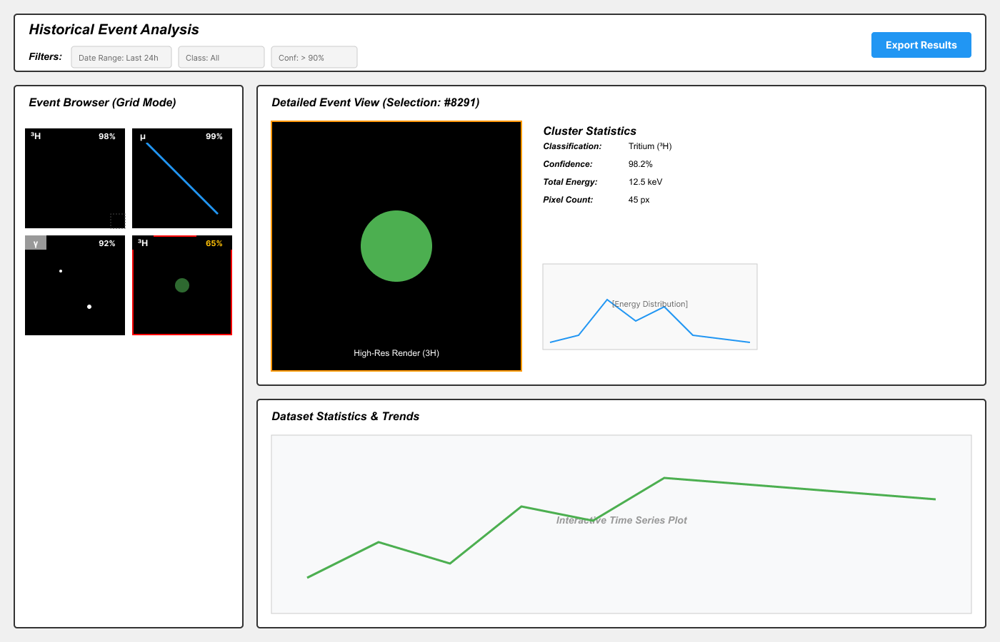

Figure 5 - A wireframe of the Historical Event Analsys View

### Interactive Raw Data Analysis Application

Figure 6 - A wireframe of the Interactive Raw Data Analysis Application
/ View

## Team communication artifacts

This section includes examples of professional communication with the
project stakeholders at LBNL:

- [Kickoff notes](../notes/Kickoff%20Notes.md)
- [Third Meeting Transcript](../notes/third_meeting_transcript.md)

## Questions / Answers

This section is populated with questions and answers derived from
kickoff and recurring meetings with project stakeholders to provide
context for design decisions.

| **Question** | **Answer** |
| --- | --- |
| **What is the core goal of this project? Are we building on an existing system?** | A lot of proof-of-concept work is already done. The goal is to take this work and formalize it into a stable, extensible, and flexible computing workflow with a user-friendly GUI. The core science is established; the goal is to build the engineering and interactive user experience around it. |
| **How does the data get from the detector to the analysis software? Is there a REST API?** | There is no real-time API (like REST or gRPC) yet. Currently, data is simply "dumped" into a local directory as .fits files with descriptive names. A future enhancement could be to host these files in a Google Drive folder that is accessible via an API. |
| **Is there an existing GUI for this project?** | No, there is no GUI so far. The lab typically interacts with data via Python scripts and Jupyter notebooks. This project will be building the GUI from the ground up. |
| **What is the data acquisition rate?** | A new FITS file (approx. 27 MB) is generated every 5 to 10 minutes. The real sensor produces data at a much lower rate than simulations, so the computational burden for the unattended pipeline is not extreme. |
| **The FITS files have multiple image quadrants. Should they be stitched together?** | No. The sensor has four quadrants, but only the 0th and 3rd produce good quality data. These should be treated as **independent exposures** and do not need to be stitched. The 1st and 2nd quadrants should be ignored. |
| **Why do the FITS data files contain negative values?** | This is a result of "pedestal subtraction." A baseline noise value (the "pedestal") is subtracted from the entire image after an exposure. Due to random fluctuations, some empty pixels end up with a slightly negative value after this process. |
| **How are the raw charge values in the FITS files converted to energy (keV)?** | The values are a measurement of charge in arbitrary units. They can be converted to energy in keV by multiplying by a conversion factor of 1.02857e-5 . |
| **Question** | **Answer** |
| **What is the preferred clustering algorithm for the high-precision pipeline?** | The lab prefers a "classical" clustering algorithm. This involves applying a noise threshold to the image (typically four times the pedestal RMS noise) and then algorithmically finding all connected groups of pixels that remain. This is considered more robust than ML-based segmentation for this data. |
| **Is there a need for both a fast, interactive analysis mode and a slower, highprecision one?** | Yes. The system requires two processing modes: 1) A highprecision "offline" mode for the unattended pipeline where accuracy is more important than speed. 2) A fast "online" mode for the interactive GUI, where a user can discover features in real-time, even if it means sacrificing some accuracy for speed. |
| **Should we create our own data structure or use the one from the lab's existing code?** | It is better to not "reinvent the wheel." The project should adopt the lab's CCDData class to ensure compatibility with their existing analysis code. This class can be extended via inheritance to add any new functionality needed, such as loading raw FITS files. |
| **Does the system need to support GPUs (e.g., for **CUDA**)? | No. A GPU is not a requirement for the baseline design. The GUI client, which may need to run on macOS, should not be designed to require a specific NVIDIA GPU. The lab only uses GPUs for intensive, offline model training on a dedicated compute cluster. |
| **How should the visualization handle values outside a userdefined filter range?** | Values below the lower bound should be filtered out. However, values _above_ the upper bound should be "truncated" or "squished"—that is, they should be displayed as the maximum value of the range, not filtered out. This is important for some analysis, especially for the CNN. |
| **Should we capture the entire area of large particle tracks, or just a fixed window?** | The fixed ten-by-ten window is specifically for tritium candidates. The system should still be able to identify and display larger tracks (like muons or Compton electrons) in their entirety as a separate case, even if they do not use the same specialized classifier. |

## References

\[1\] “FITS File Handling (astropy.io.fits) — Astropy v7.1.1.” Accessed:
Oct. 22, 2025. \[Online\]. Available:
https://docs.astropy.org/en/stable/io/fits/index.html

\[2\] L. McInnes, J. Healy, and S. Astels, “hdbscan: Hierarchical
density based clustering,” *JOSS*, vol. 2, no. 11, p. 205, Mar. 2017,
doi: 10.21105/joss.00205.

\[3\] A. Nicoomanesh, “Model Drift: Identifying and Monitoring for Model
Drift in Machine Learning Engineering and…,” Medium. Accessed: Nov. 23,
2025. \[Online\]. Available:
https://medium.com/@anicomanesh/model-drift-identifying-and-monitoring-for-model-drift-in-machine-learning-engineering-and-0f74b2aa2fb0

\[4\] E. Rofors *et al.*, “Utilizing Deep Learning for Enhanced Tritium
Detection in CCDs,” Aug. 01, 2025, *arXiv*: arXiv:2508.00532. doi:
10.48550/arXiv.2508.00532.

\[5\] “Kickoff Meeting Transcript.” Accessed: Nov. 15, 2025. \[Online\].
Available:
https://github.com/OSUCSVisualizationTeam/le-beta-particle-vis-lbnl/blob/main/notes/Kickoff%20Notes.md#raw-transcript

\[6\] “Visualization and Discernment of Low-Energy Beta Particle Tracks
from Live CCD Detector Data,” Visualization and Discernment of
Low-Energy Beta Particle Tracks from Live CCD Detector Data. Accessed:
Oct. 15, 2025. \[Online\]. Available:
https://eecs.engineering.oregonstate.edu/capstone/submission/pages/viewSingleProject.php?id=PqndOkoBofrFEYKd

\[7\] FITS Working Group, “FITS Primer.” Accessed: Nov. 28, 2025.
\[Online\]. Available: https://fits.gsfc.nasa.gov/fits_primer.html
