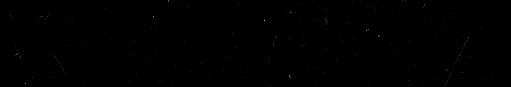
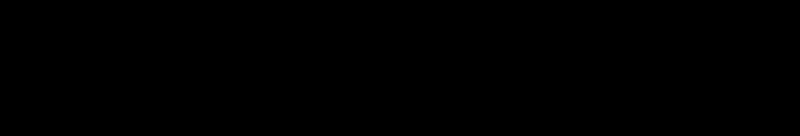
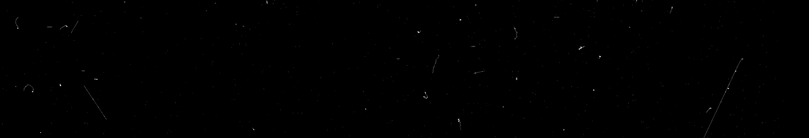
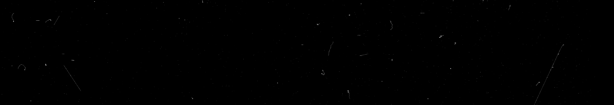

# Prototype: Using OpenCV on FITS data

## Libraries

### Astropy
A Python library for astronomy that provides tools to read, write, and manipulate FITS files and other astronomical data formats.
```
pip install astropy
```

### OpenCV
A computer vision library used for image processing, analysis, and manipulation tasks.
```
pip install opencv-contrib-python
```

### Numpy
A fundamental package for scientific computing in Python, providing support for large, multi-dimensional arrays and matrices along with mathematical functions.
```
pip install numpy
```

### Matplotlib
A plotting library for creating static, interactive, and animated visualizations in Python.
```
pip install matplotlib
```

## Data

### Background Only
```
Filename: data\subMed_proc_3oct2022_G2ccd_back_meas___EXP1_NSAMP9_VSUB70_img65.fits
No.    Name      Ver    Type      Cards   Dimensions   Format
  0  PRIMARY       1 PrimaryHDU     163   (3200, 550)   float32
  1                1 ImageHDU       162   (3200, 550)   float32
  2                1 ImageHDU       162   (3200, 550)   float32
  3                1 ImageHDU       162   (3200, 550)   float32
```

### Background + Tritium
```
Filename: data\subMed_proc_6oct2022_G2ccd_h3_meas_v2___EXP1_NSAMP1_VSUB70_img591.fits
No.    Name      Ver    Type      Cards   Dimensions   Format
  0  PRIMARY       1 PrimaryHDU     163   (3200, 550)   float32
  1                1 ImageHDU       162   (3200, 550)   float32
  2                1 ImageHDU       162   (3200, 550)   float32
  3                1 ImageHDU       162   (3200, 550)   float32
```

## Read FITS Data

### Load FITS data
```
fits_data ='data\\subMed_proc_6oct2022_G2ccd_h3_meas_v2___EXP1_NSAMP1_VSUB70_img591.fits'

# open the FITS file at the specific path
hdul = fits.open(fits_data)
# save FIST data for later usage
fits_data = [hdu.data for hdu in hdul if hdu.data is not None]
```

### Display Raw FITS Data via Matplotlib
NOTE: FITS data supplied by LBNL contains 4 HDUs in each FITS file
```
# since our FITS data contains 4 images per file, loop through all HDUs to see each one 
for i, hdu in enumerate(hdul) : 

    # display the image using matplotlib
    if hdu.data is not None : 
        # Display the image
        plt.figure(i)
        plt.imshow(hdu.data, cmap='gray', origin='lower')
        plt.axis('off')
        plt.title(f'HDU {i} Image')
        
        # plt.savefig(f'images\\background_only_hdu_{i}_image.png', bbox_inches='tight', pad_inches=0)     # save image to disk space for easier reference
    else : 
        print("No image data in this HDU")

# display all HDUs
plt.show()
```

## Normalizing FITS Data: Float32 --> UInt8

### Conversion Function
Normalizes a NumPy float32 array to the 0–255 range and returns it as uint8, with a fallback to zeros if all values are identical
```
def float32_to_uint8(data) : 
    data_min = np.min(data)
    data_max = np.max(data)

    if data_max == data_min : 
        return np.zeros(data.shape, dtype.uint8)    # error handling for bad data that was passed
    
    normalized = (data - data_min) / (data_max - data_min)
    uint8_data = (normalized * 255).astype(np.uint8)
    return uint8_data
```

### Apply Conversion Function To FITS Data
```
uint8_data = [float32_to_uint8(image) for image in fits_data]
```

## Display Original HDU Images Using OpenCV

### Use OpenCV's imshow() Function
```
for i, hdu in enumerate(uint8_data) : 
    cv.imshow(f"HDU: {i}", hdu)
```

## Original UInt8 Image of HDU 3 - Background + Tritium


## OpenCV Operations on FITS Data: Edge Detection + Thresholds
FITS HDU used for follow OpenCV operations: `uint8_image = uint8_data[3]`

### Canny Edge Detection
The cv.Canny function detects edges in the image. You can adjust the `threshold1` and `threshold2` parameters to control the sensitivity of edge detection.
```
# Canny Edge Detection
canny_edges = cv.Canny(uint8_image, threshold1=100, threshold2=200)

# Display Canny Edges
cv.imshow('Canny Edges', canny_edges)
```

### Canny Edge Results


### Simple Threshold
The cv.threshold function converts the image to a binary image based on a fixed threshold (25 in this case). Pixels above this threshold are set to 255 (white), and those below are set to 0 (black).
```
# Simple Threshold
ret, thresh = cv.threshold(uint8_image, 25, 255, cv.THRESH_BINARY)

# Display Simple Threshold
cv.imshow('Simple Threshold', thresh)
```

### Simple Threshold Results


### Adaptive Threshold
The cv.adaptiveThreshold function calculates the threshold for smaller regions of the image, which can be useful for images with varying lighting conditions.
```
# Adaptive Threshold
adaptive_thresh = cv.adaptiveThreshold(uint8_image, 255, cv.ADAPTIVE_THRESH_GAUSSIAN_C, cv.THRESH_BINARY, blockSize=11, C=2)

# Display Adaptive Threshold
cv.imshow('Adaptive Threshold', adaptive_thresh)
```

### Adaptive Threshold Results


## K Means Implementation

### Function Definition
This function performs K-Means clustering on the input image, reshaping it for processing, applying the K-Means algorithm, and returning a segmented image based on the specified number of clusters k.
```
def kmeans_segmentation(image, k=2) : 
    pixel_values = image.reshape((-1, 1))  # Reshape to (num_pixels, 1)
    pixel_values = np.float32(pixel_values)  # Convert to float32 (if not already)

    criteria = (cv.TERM_CRITERIA_EPS + cv.TERM_CRITERIA_MAX_ITER, 100, 0.2)
    ret, labels, centers = cv.kmeans(pixel_values, k, None, criteria, 10, cv.KMEANS_RANDOM_CENTERS)

    # Convert to uint8 for visualization purposes
    centers = float32_to_uint8(centers)
    segmented_image = centers[labels.flatten()]
    
    # Reshape back to the original image shape
    segmented_image = segmented_image.reshape(image.shape)

    return segmented_image
```

### Read FITS Data
This section opens the specified FITS file, extracts the image data from each HDU (Header Data Unit), and stores it in a list for further processing, ensuring that only valid data is retained.
NOTE: No need to convert float32 to uint8 until later, as k-means expects float32 values.
```
fits_data ='data\\subMed_proc_6oct2022_G2ccd_h3_meas_v2___EXP1_NSAMP1_VSUB70_img591.fits'     # Background + Tritium

# open the FITS file at the specific path
hdul = fits.open(fits_data)
fits_data = [hdu.data for hdu in hdul if hdu.data is not None]

hdul.close()
```

### Preform K Means
This part selects the third HDU from the FITS data and iteratively applies K-Means segmentation with varying values of k (from 1 to 10), saving the resulting segmented images to the specified directory for analysis.
```
hdu_3 = fits_data[3]
for i in range(1, 11) : 
    segmented_hdu = kmeans_segmentation(hdu_3, k=i)
```

## K Means Results For K = 1-10 On HDU 3 - Background + Tritium Image
NOTE: On the sample data provided by LBNL, there is not much visual variation beyond K=3; however, increasing the number of clusters may still help in identifying subtle differences in pixel intensity distributions or in enhancing specific features that could be relevant for further analysis.

### K = 1


### K = 2


### K = 3


### K = 4


### K = 5


### K = 6


### K = 7


### K = 8


### K = 9


### K = 10
